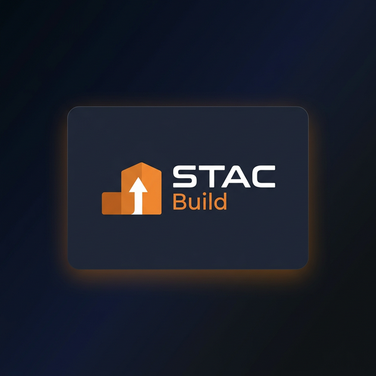

<p align="center">
  
</p>

<p align="center">
  <strong>Spatio-Temporal Awareness Core — Construction Dimensional Control System</strong>
</p>

<p align="center">
  <em>AI-powered As-Built vs As-Planned comparison via dense 3D reconstruction and BIM deviation analysis</em>
</p>

---

## What is STAC?

**STAC Build** is a construction dimensional control system that compares **As-Built reality** (captured via smartphone video) against **As-Planned design** (BIM/IFC models) to detect geometric deviations and track construction progress.

The system reconstructs a dense, metric **point cloud + textured mesh** from a phone
video (optionally with iPad/iPhone LiDAR), segments construction elements, and
compares the result against the BIM/IFC model to measure deviations and coverage.

### Core Workflow (the real 6-stage pipeline)

Orchestrated by `pipeline_manager.py`; each stage runs as an isolated subprocess.

```
📱 Capture: smartphone video (MP4)  +  optional 📷 Stray Scanner (LiDAR + ARKit)
    │
    ▼
🔨 1. 3D Reconstruction   (backend: mapanything │ vggtomega │ da3 │ hybrid │ hybrid_cond │ lidar)
    ├─ Blur filter, then GEOMETRIC keyframe selection (default `frames_selector: parallax`):
    │     • DA3 metric depth+pose on ALL blur-valid frames, then keyframes by TRIANGULATION
    │       ANGLE (baseline), not appearance → selected_frames.json. Pure rotation aborts.
    │     • DINO-cosine 0.99 dense set (da3_frames.json) → DA3 per-frame depth (keyframes ∪ fillers)
    ├─ MapAnything per-chunk (VGGT-Long framework), fed DA3 metric depth+K → poses + cloud
    │     • mapanything : MapAnything estimates the poses (DA3 poses NOT used)
    │     • vggtomega   : VGGT-Omega backbone (CVPR'26) up-to-scale → scale-aligned to DA3 metric
    │     • hybrid_cond : ARKit-conditioned DA3 → MapAnything FULL prior (depth+K+poses)
    ├─ SALAD/DINOv2 loop closure + Sim3 global alignment
    ├─ GLOBAL POSE REFINEMENT — dense two-pass bundle adjustment (the gold standard):
    │     • VGGSfM learned tracks over keyframes + fillers → COLMAP/Ceres BA
    │     • pass 1: pose-prior BA over keyframes → refined poses + 3D landmarks (the map)
    │     • pass 2: keyframes + landmarks FIXED, fillers localised against the map
    ├─ DENSIFY: back-project each localised filler's DA3 depth at its BA pose → extra cloud
    │     (replaces the old ICP; fillers are now globally consistent with the keyframe backbone)
    └─ RANSAC auto-leveling (floor → gravity).  NO silent fallbacks — any stage that fails ABORTS.
    │
    ▼
🧹 2. Cloud Cleaning      → CloudCompPy SOR + voxel merge → cleaned_cloud.ply
    ▼
🧊 3. TSDF Mesh           → textured surface mesh (Open3D VoxelBlockGrid, GPU, tiling + photo bake)
                            hybrid depth: MapAnything (keyframes) + DA3 resized (fillers)
    ▼
🔍 4. Scene Analysis      → VLM (InternVL3): object inventory that prompts segmentation
    ▼
🏷️ 5. Segmentation        → SAM3: 2D instance masks matched to the cloud at display time
    ▼
✨ 6. Instance Cleaning   → merge/dedup per-object instances across frames
    │
    ▼
📐 BIM Comparison & Registration
    ├─ Scan-to-BIM alignment (gizmo + ICP)
    ├─ Cloud-to-Mesh deviation (C2M)
    └─ Coverage analysis per BIM element
    │
    ▼
📊 Visualization & Reports
    ├─ Sábana: color-coded deviation map
    ├─ Potree: level-of-detail point cloud streaming
    ├─ BIM overlay: Three.js + IFC rendering
    └─ Per-element metrics: coverage %, deviation stats
```

### Pose refinement & densification — dense two-pass bundle adjustment

The reconstruction follows classical SfM/SLAM best practice rather than appearance shortcuts:

**1. Geometric keyframe selection (parallax).** Cosine-DINO measures *appearance*, not the
geometric *baseline* a multi-view backbone needs — it adds a degenerate keyframe on pure
rotation and misses frontal advance. Instead (`frames_selector: parallax`,
`server/frames/selector.py::select_keyframes_parallax`), DA3 runs metric depth+pose on all
blur-valid frames first, then a keyframe is taken when the **median triangulation angle** vs the
last keyframe reaches `theta_parallax` (≈1.5°). Pure rotation → C_i≈C_j → ~0 parallax → never
fires; a clip with no baseline **aborts** with a clear UI message. Cosine stays only for DA3's
dense set.

**2. Global pose refinement — two-pass BA** (`reconstruction/{vggt_tracks,colmap_ba,run_colmap_ba}.py`).
MapAnything's per-chunk poses drift; we refine them with the **battle-tested COLMAP/Ceres**
bundle adjuster over **learned VGGSfM correspondences** (robust to low-texture indoors):
  - **Pass 1** — pose-prior BA over the keyframes → refined poses + triangulated 3D landmarks (the
    map). Pose priors anchor to MapAnything → stays metric, no gauge drift.
  - **Pass 2** — add the inter-keyframe **fillers**, link their observations to the landmarks, hold
    the keyframes **and** the landmarks **constant**, and optimise only the filler poses
    (localisation against the fixed map). Keyframes are never degraded; fillers become globally
    consistent with the keyframe backbone.

**3. Densification** (`reconstruction/densify_fillers.py`, replaces the old ICP). Each localised
filler's DA3 metric depth is back-projected at its **BA pose** → extra cloud points
(`chunk_997_densefusion.ply`) that CloudCompPy merges, with the same confidence filter as the
backbone. The keyframe chunks are re-projected to the refined keyframe poses
(`reproject_chunks.py`), and the TSDF integrates depth at the **same** refined keyframe + BA
filler poses (`filler_poses.npz`, used over SLERP) → **cloud and mesh are dense AND consistent**
(same poses everywhere).

> **Fail-fast everywhere.** Every stage (frame selection, DA3 priors, BA, densification, cloud
> cleaning, TSDF) **raises on failure** instead of silently degrading — a successful finish means
> every stage actually worked. There are no "skipped / image-only / keeping previous" escapes.

---

## Technology Stack

### Reconstruction, Analysis & Segmentation

| Component | Technology | Purpose |
|-----------|-----------|---------|
| **DA3** | [Depth Anything 3](https://github.com/ByteDance-Seed/Depth-Anything-3) | Metric monocular depth (+ optional poses). Runs standalone (`da3` backend) **or** as the per-frame **metric depth prior fed into MapAnything**. In `hybrid_cond` it is ARKit-pose-conditioned + LiDAR-calibrated |
| **MapAnything** (default) | [MapAnything](https://github.com/facebookresearch/map-anything) (Meta) inside the [VGGT-Long](https://github.com/DengKaiCQ/VGGT-Long) framework | Feed-forward metric 3D, run **per chunk** with chunk overlap + **SALAD/DINOv2 loop closure + Sim3** global alignment. Fed DA3 depth+K as prior (poses too in `hybrid_cond`); generates the global point cloud |
| **VGGT-Omega** (option) | [VGGT-Ω](https://vggt-omega.github.io/) (CVPR 2026) | Optional SOTA camera/pose backbone, dynamic-scene robust. Up-to-scale → metric scale recovered by aligning to DA3 depth (`scale_align.py`). Selected via `backend: vggtomega` |
| **Keyframe selection** | Parallax (triangulation angle) / DINOv2-cosine | **Geometric** keyframing for the SLAM backbone (`select_keyframes_parallax`); cosine kept for DA3's dense set |
| **Correspondences** | [VGGSfM](https://github.com/facebookresearch/vggsfm) tracker | Learned 2D-2D tracks (robust to low-texture indoors) feeding the bundle adjustment |
| **Bundle adjustment** | [pycolmap](https://github.com/colmap/colmap) / COLMAP Ceres | Dense two-pass pose-prior BA: keyframes refined, fillers localised against the fixed map |
| **Loop closure** | [DINOv2](https://github.com/facebookresearch/dinov2) / SALAD | Place-recognition retrieval for loop detection; Sim3 optimization closes drift over long sequences |
| **Stray Scanner** | [Stray Scanner](https://apps.apple.com/app/stray-scanner/id1557051662) (iOS) | iPhone/iPad Pro LiDAR + ARKit capture for `hybrid` / `hybrid_cond` / `lidar` modes |
| **Scene Analysis (VLM)** | [InternVL3](https://github.com/OpenGVLab/InternVL) | Scans frames to build an object inventory that prompts segmentation |
| **Segmentation** | [SAM3](https://github.com/facebookresearch/sam2) (Segment Anything 3) | Open-vocabulary instance segmentation of construction elements |
| **Cloud merge** | [CloudCompPy](https://www.cloudcompare.org/) | SOR outlier removal + voxel downsample, chunk/LiDAR-complement merge → `cleaned_cloud.ply` |
| **TSDF mesh** | [Open3D](https://www.open3d.org/) VoxelBlockGrid (CUDA) | Textured surface mesh from the cleaned cloud (GPU integrate, **3D cube tiling welded into one mesh**, long-edge cull, hole-fill, GPU multi-view photo bake with true mesh z-buffer occlusion) |
| **Point Cloud Viz** | [Potree](https://potree.github.io/) + [Three.js](https://threejs.org/) | Level-of-detail point cloud rendering |

### Platform

| Component | Technology | Purpose |
|-----------|-----------|---------|
| **BIM Parsing** | [IfcOpenShell](https://ifcopenshell.org/) | IFC geometry extraction |
| **Backend** | Python 3.11, Flask, WebSocket | Pipeline orchestration, API |
| **Frontend** | React + TypeScript + Vite | IDE-style viewer interface |
| **Infrastructure** | Docker, CUDA 12.1 | GPU-accelerated containerized deployment |

---

## Features

### Dense 3D Reconstruction
- **Multi-backend architecture** (`reconstruction.backend` in `config.yaml`, dispatched in `map_worker.py`):
  - **`mapanything`** (default, video-only): DA3 produces per-frame **metric depth + intrinsics** → fed as a **prior** into **MapAnything** (run per-chunk inside the VGGT-Long framework). MapAnything **estimates its own poses** (DA3 poses are intentionally NOT used) and closes loops via SALAD/DINOv2 + Sim3 → global point cloud, then the **dense two-pass BA** refines keyframe poses + localises fillers.
  - **`vggtomega`** (video-only, SOTA poses): **VGGT-Ω** (CVPR 2026) replaces MapAnything as the backbone (+77% camera accuracy, dynamic-scene robust). It is up-to-scale → metric scale is recovered by aligning to DA3 depth. No ICP (its poses are globally optimised).
  - **`hybrid_cond`** (Stray / LiDAR, full prior): Stray ARKit + LiDAR → DA3 is **pose-conditioned** (ARKit poses via cam_enc) with **LiDAR-calibrated** metric depth → MapAnything receives the **FULL prior (depth + K + poses injected)** → loop closure.
  - **`da3`**: DA3 streaming standalone (neural depth + SLAM, no LiDAR, no MapAnything).
  - **`hybrid`**: DA3 calibrated with Stray LiDAR depth (estimate-then-inject poses).
  - **`lidar`**: pure LiDAR backprojection (Stray only, no neural inference).
  - **`gaus_slam*`** / **`nerfstudio`**: experimental Gaussian-surfel SLAM and NeuS-SDF variants.
- **DA3-as-prior** is opt-in (`mapanything.use_da3_priors`), forced ON for `hybrid_cond`. Poses are injected only when `da3_prior_use_poses` (auto-true in `hybrid_cond`); otherwise only depth + K.
- **Stray Scanner integration**: auto-detection of iOS data (`odometry.csv`, `depth/`, intrinsics).
- Chunk-based MapAnything inference (`chunk_size` / `overlap`) with Sim3 overlap alignment for long sequences.
- **Geometric (parallax) keyframe selection** by default — triangulation angle, not appearance; pure-rotation clips abort with a clear message. DINO-cosine + uniform stride + all-frames remain available. Optional Laplacian blur filter.
- **Global pose refinement**: dense two-pass COLMAP/Ceres bundle adjustment over learned VGGSfM correspondences (keyframes refined, fillers localised, then densified back into the cloud).
- Confidence filtering at the authors' defaults (DA3 `conf_thresh_percentile ≈ 40`, MapAnything/VGGT `conf_threshold_coef 0.75`).
- RANSAC auto-leveling (floor detection and gravity alignment).
- **Fail-fast pipeline**: every stage aborts on failure (no silent fallbacks) — a finished run means every stage actually worked.
- **TSDF meshing** (final stage): the cleaned cloud is meshed into a textured surface — Open3D VoxelBlockGrid on GPU, **3D cube tiling welded into one mesh**, long-edge cull + hole-fill, GPU multi-view photo bake with true mesh z-buffer occlusion.

### Semantic Segmentation
- **Scene Analysis (VLM)**: InternVL3 scans frames and generates an object inventory that prompts segmentation
- **SAM3**: open-vocabulary instance segmentation — per-frame **2D instance masks**, stored cloud-agnostically and **matched to the point cloud at display time** (no destructive 3D assignment)
- **Instance cleaning** stage: merges/dedups per-object instances across frames
- Interactive retroactive prompting: point-and-click to re-segment

### BIM Integration
- Full IFC parsing: geometry extraction for all physical elements
- Scan-to-BIM registration via gizmo alignment + ICP refinement
- Cloud-to-Mesh (C2M) deviation calculation per element
- Coverage analysis: percentage of BIM surface observed by scan
- Quality classification: Good / Regular / Bad per element

### Sábana Visualization
- Color-coded deviation map: Green (within tolerance) → Yellow → Red (out of tolerance)
- Rendered as a point cloud overlaid on BIM for direct visual inspection
- Semi-transparent BIM and scan cloud to highlight deviations
- Per-element statistics: mean, max, P95 deviation, pass rate

### Potree Streaming
- Custom Potree integration for level-of-detail rendering of massive point clouds
- Hierarchical octree with progressive loading
- Point budget management for smooth navigation

### Team & Session Management
- JWT authentication with role-based access (admin/viewer)
- Multi-user team workspaces
- Session persistence with full pipeline state
- Real-time WebSocket progress streaming
- Activity logging per user

---

## Architecture

```
stac-builder/
├─ server/                    # Python backend
│   ├─ main.py                # FastAPI app, WebSocket, API routes
│   ├─ pipeline_manager.py    # 6-stage pipeline orchestrator
│   ├─ workers/               # Subprocess workers (GPU-isolated)
│   │   ├─ base.py            # WorkerPipe IPC protocol
│   │   ├─ map_worker.py      # 1. Reconstruction dispatcher (mapanything/vggtomega/da3/hybrid/...)
│   │   │                      #    + parallax keyframe selection + the global BA / densify step
│   │   ├─ cloudcompy_worker.py # 2. Cloud cleaning (SOR + voxel) + LiDAR complement merge
│   │   ├─ tsdf_worker.py     # 3. TSDF textured mesh (Open3D VoxelBlockGrid, GPU)
│   │   ├─ vlm_worker.py      # 4. InternVL3 scene analysis
│   │   ├─ sam3_worker.py     # 5. SAM3 segmentation
│   │   └─ instance_cleaner_worker.py # 6. Instance cleaning (merge/dedup)
│   ├─ stray_da3_streaming.py # Hybrid + LiDAR-only DA3 subclasses
│   ├─ run_da3_hybrid_main.py # Entry point for hybrid/LiDAR subprocess
│   ├─ run_da3_hybrid.sh      # Shell launcher (conda env activation)
│   ├─ ingestors/
│   │   ├─ stray_detector.py  # Auto-detect Stray Scanner data in sessions
│   │   └─ stray_scanner.py   # Load ARKit poses, LiDAR depth, intrinsics
│   ├─ frame_quality.py       # Blur detection (Laplacian)
│   ├─ frames/selector.py     # Keyframe selection: parallax (geometric) + DINOv2-cosine
│   ├─ reconstruction/        # Global pose refinement + densification
│   │   ├─ vggt_tracks.py     #   learned VGGSfM correspondences (dense: keyframes + fillers)
│   │   ├─ colmap_ba.py       #   COLMAP/Ceres two-pass bundle adjustment engine
│   │   ├─ run_colmap_ba.py   #   BA runner: keyframes refined + fillers localised
│   │   ├─ densify_fillers.py #   back-project filler depth at BA poses → extra cloud
│   │   ├─ reproject_chunks.py#   re-project keyframe chunks to refined poses (cloud↔mesh)
│   │   └─ scale_align.py     #   metric scale for the VGGT-Omega path (align to DA3)
│   ├─ alignment_manager.py   # SIM3 alignment + auto-leveling
│   ├─ scene_analyzer.py      # InternVL3 scene inventory
│   ├─ segmentation/pipeline.py # 2D instance masks → display-time cloud matching
│   ├─ bim_comparison.py      # C2M deviation, sábana, coverage
│   ├─ bim_registration.py    # Scan-to-BIM alignment (ICP)
│   └─ config.yaml            # All pipeline configuration
│
├─ ui/                        # React + TypeScript frontend
│   └─ src/
│       ├─ App.tsx             # Main application shell
│       ├─ components/
│       │   ├─ IFCLoader.ts    # BIM model rendering
│       │   ├─ PotreeLoader.ts # Point cloud streaming
│       │   └─ InteractiveSegmentation.tsx
│       └─ pages/
│           └─ LoginPage.tsx   # Authentication
│
├─ vendor/                    # AI model integrations
│   ├─ depth-anything-3/      # DA3 — metric depth + per-frame pose (prior, scale anchor, standalone)
│   ├─ VGGT-Long/             # framework: per-chunk MapAnything + SALAD/DINOv2 loop closure + Sim3
│   │                          #   + vendored VGGSfM tracker (correspondences) + VGGTOmega adapter
│   ├─ vggt-omega/            # VGGT-Ω backbone (optional `vggtomega` backend; imported, unmodified)
│   ├─ MapAnything2/          # MapAnything model (per-chunk feed-forward metric 3D)
│   ├─ dinov3/                # DINO backbone (loop-closure place retrieval)
│   ├─ sam3/                  # SAM3 open-vocabulary segmentation
│   ├─ CloudComPy310/         # CloudCompare Python — cloud SOR + voxel merge
│   ├─ nvdiffrast/            # GPU texture bake for the TSDF mesh
│   ├─ mvs-texturing/         # UV-atlas texture baking (texrecon, CPU fallback)
│   └─ PotreeConverter/       # Octree generation
│
├─ docs/                      # Documentation
│   ├─ ROADMAP.md
│   ├─ FUTURE_VISION.md
│   ├─ ARCHITECTURE.md
│   └─ SCANNING_GUIDE.md
│
└─ static/                    # Legacy viewer + camera capture
```

---

## Camera Pose & Localization

Accurate camera poses drive the whole pipeline — they place every depth observation into the global cloud, refine it via loop closure, and let the TSDF mesh be photo-textured from the source frames. STAC uses a layered approach:

| Source | Type | Accuracy | When |
|--------|------|----------|------|
| **MapAnything + loop closure** | Feed-forward poses, SALAD/Sim3-refined | High relative, ~cm inter-frame | **Default** (`mapanything` / `hybrid_cond`) — these become `camera_poses.txt` used downstream |
| **ARKit (Stray Scanner)** | VIO + IMU + LiDAR | ~cm absolute, metric-scale | `hybrid_cond` — injected into MapAnything as a **pose prior**, then loop-closed |
| **DA3 SLAM** | Neural SLAM (SALAD), loop-closed | High relative, ~cm inter-frame | `da3` standalone backend |
| **Gizmo + ICP** | Manual alignment → refinement | Depends on user + ICP | Scan→BIM registration |

**Pose Sources** (per the actual code):
- **`mapanything` (default):** **MapAnything estimates the poses.** DA3 contributes only the **metric depth + intrinsics** prior — its poses are intentionally NOT used (`da3_prior_use_poses: false`). SALAD/DINOv2 loop closure + Sim3 then refine them globally.
- **`hybrid_cond`:** Stray **ARKit poses condition DA3** (cam_enc) and are **injected into MapAnything as the full prior** (depth + K + poses). MapAnything still loop-closes them, so the priors initialize but do not freeze the solution.
- **`da3` standalone:** DA3's own neural SLAM (SALAD features) handles all pose estimation.

**Global consistency**: over long sequences, per-chunk poses drift. Two layers fix it: (1) SALAD/DINOv2 place-recognition + Sim3 loop closure inside VGGT-Long, then (2) a **dense two-pass bundle adjustment** (COLMAP/Ceres over learned VGGSfM tracks) that refines the keyframe poses (pose-prior anchored → metric) and localises the inter-keyframe fillers against the fixed keyframe map. The refined keyframe poses are written to `camera_poses.txt` and the localised filler poses to `ba_run/filler_poses.npz`; every downstream stage (densification, TSDF, texture bake, BIM overlay) integrates at these **same** poses → cloud and mesh stay consistent.

---

## Pipeline Configuration

All pipeline parameters are centralized in `server/config.yaml`:

```yaml
# Key configuration sections
reconstruction:
  backend: mapanything         # mapanything | vggtomega | da3 | hybrid | hybrid_cond | lidar
  frames_selector: parallax    # parallax (geometric, default) | dino | stride | none
  mapanything:                 # MapAnything model, run inside the VGGT-Long framework
    use_da3_priors: true       # feed DA3 metric depth + intrinsics as prior
    da3_prior_use_poses: false # also inject DA3 poses (auto-true in hybrid_cond)
    conf_threshold_coef: 0.75  # VGGT-Long point-cloud confidence filter
  vggtomega:                   # optional VGGT-Ω backbone (gated weights → vendor/vggt-omega-weights)
    resolution: 512
  bundle_adjust:               # global pose refinement (dense two-pass BA), runs after the backend
    enabled: true
    track_window: 24           # VGGSfM tracking window (keyframes + fillers)
    prior_stddev_m: 0.10       # how tightly the BA anchors to the backbone poses
  dense_fusion:
    enabled: false             # OFF — superseded by the two-pass BA + densify_fillers
  lidar:
    trust_range: 5.0
    fallback_to_da3: true

tsdf:                          # final stage: textured mesh from cleaned_cloud.ply
  voxel_length: 0.012          # ~1.2 cm voxels
  depth_source: da3_frames     # hybrid: MapAnything depth (keyframes) + DA3 depth (fillers)
  tsdf_tile_length_m: 10.0     # 3D CUBE tiling (10 m cubes) welded into one mesh
  tsdf_max_edge_m: 0.30        # cull spurious long "bridge" triangles
  fill_holes: true             # close small dropouts (mesh sanitised before VTK)
  texture_mode: vertex_gpu     # GPU multi-view photo bake (nvdiffrast, true mesh z-buffer occlusion)

frame_selection:               # keyframe selection params
  theta_parallax: 1.5          # deg: new keyframe once the median triangulation angle reaches this
  overlap_min: 0.5             # force a keyframe if overlap drops (only with real translation)
  min_global_baseline_m: 0.3   # pure rotation / no baseline → ABORT
  min_keyframes: 20            # too few keyframes → ABORT
  dino_threshold: 0.98         # cosine threshold (used by frames_selector: dino, and DA3 dense set)

alignment:
  method: "scale+se3"         # SIM3 alignment
  auto_leveling:
    enabled: true             # RANSAC floor detection

bim:
  deviation:
    tolerance_mm: 20.0        # Deviation threshold
    coverage_proximity_m: 0.15
```

### Reconstruction Backend Selection

The API endpoint `GET /api/sessions/{id}/available_backends` auto-detects which backends are viable for each session based on the presence of Stray Scanner data (`depth/`, `odometry.csv`, `camera_matrix.csv`).

---

## Hardware Requirements

| Component | Minimum | Recommended |
|-----------|---------|-------------|
| **GPU** | RTX 3060 6GB (CPU fallback for large models) | RTX 4090 (24GB VRAM) |
| **CPU** | 8 cores | 16+ cores |
| **RAM** | 32 GB | 64 GB |
| **Storage** | SSD 500GB | NVMe 1TB+ |

---

## Quick Start

### 1. Clone WITH submodules (required — a plain `git clone` will NOT work)

Several vendored dependencies are pinned as **git submodules**, including two **STAC forks
that carry local patches the pipeline depends on**:

| Submodule | Remote | Notes |
|-----------|--------|-------|
| `vendor/VGGT-Long` | `hernanbarreto/VGGT-Long` (STAC fork) | loop-closure + sky-removal + DA3-prior patches |
| `vendor/depth-anything-3` | `hernanbarreto/Depth-Anything-3` (STAC fork, **private**) | cam-encoder pose conditioning + sky drop |
| `vendor/DepthLM_Official`, `vendor/perception_models` | upstream | unpatched |

```bash
# Clone the repo AND all submodules in one step (recommended)
git clone --recursive https://github.com/hernanbarreto/stac-build.git
cd stac-build

# If you already cloned without --recursive:
git submodule update --init --recursive
```

> ⚠️ `vendor/depth-anything-3` points to a **PRIVATE** STAC fork. You need GitHub access to
> `hernanbarreto/Depth-Anything-3` (a PAT / SSH key configured) or the submodule fetch fails.
> The patches there are **required** — without them DA3 behaves differently than here.

### 2. Provision the git-ignored vendors (NOT in the repo)

Heavy/third-party vendors are **git-ignored** and are **not** fetched by clone or by Docker
(`Dockerfile` does `COPY vendor/ ./vendor/`, i.e. it copies whatever is already on disk).
They must be placed under `vendor/` manually before building:
`meshflow`, `mvs-texturing`, `nvdiffrast`, `oneTBB` / `oneTBB-src`, `CloudComPy310`,
`dn-splatter`, `gaus-slam`, `scenescript`, `vipe`, plus the `*/checkpoints/` weight dirs.

### 3. Download model weights

```bash
./setup_weights.sh    # DA3 DINO-SALAD, SAM3, VLM (others auto-download via HF Hub on first run)
```

### 4. Build and run

```bash
# Docker (copies the local vendor/ tree into the image)
docker compose up --build

# Or run locally
pip install -r requirements.txt
cd ui && npm install && npm run build && cd ..
python server/main.py
```

Access the application at `http://localhost:5000`

---

## Supported Formats

| Type | Formats |
|------|---------|
| **Video input** | MP4, AVI, MOV |
| **LiDAR input** | Stray Scanner (depth PNGs + odometry CSV + intrinsics CSV) |
| **BIM models** | IFC 2x3, IFC 4, IFC 4.3 |
| **Point clouds** | PLY (native), Potree octree |
| **Meshes** | GLB (TSDF textured surface mesh) |
| **Export** | PLY, GLB, JSON metrics, Potree |

---

## Roadmap

See [ROADMAP.md](docs/ROADMAP.md) for the full development roadmap and [FUTURE_VISION.md](docs/FUTURE_VISION.md) for the strategic platform vision.

---

<p align="center">
  <sub>Designed and developed by <strong>Hernán Barreto</strong></sub>
</p>
