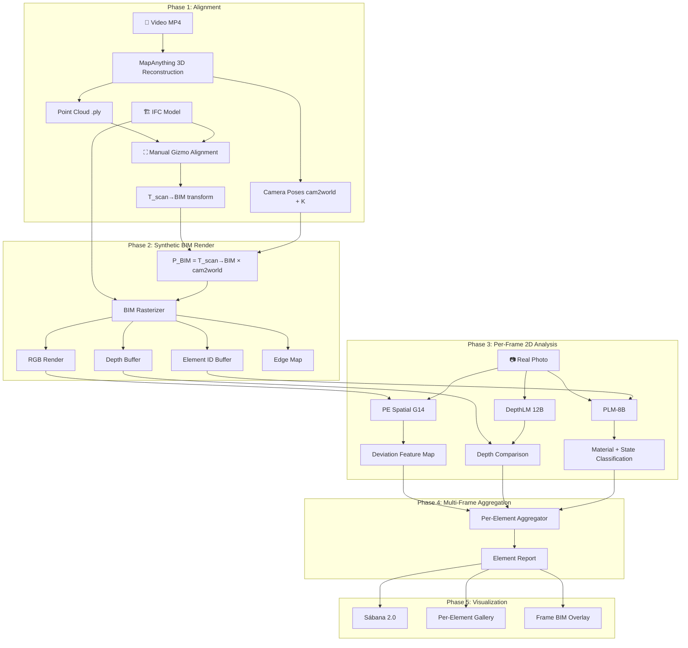

# ADR-002: 2D Comparison Pipeline

> **Author:** Hernán Barreto — Ingerop IN3  
> **Date:** 2026-03-21  
> **Status:** Design — pending implementation  
> **Depends on:** [ADR-001: 2D Analysis Pivot](./001-2d-analysis-pivot.md)

---

## Overview

This document defines the complete pipeline for **As-Built vs As-Planned comparison in 2D image space**. The pipeline takes smartphone video and BIM (IFC) as input and produces per-element deviation analysis by comparing real photographs against synthetic BIM renders from identical camera viewpoints.

### Core Principle

> Instead of comparing 3D point clouds against BIM meshes (lossy, noisy), we compare **the original high-resolution photos** against **BIM renders from the same camera pose** — staying in the domain where AI models are most precise.

---

## Pipeline Overview



---

## Phase 1: Alignment (Existing)

**Status:** ✅ Implemented

Produces camera poses in BIM coordinate space.

```
Video MP4
    │
    ▼
MapAnything → chunk_*.ply + cam2world matrices + intrinsics K
    │
    ▼
Manual Gizmo → T_scan→BIM (4×4 rigid body transform)
    │
    ▼
Poses in BIM space:  P_cam_bim(i) = T_scan→BIM × cam2world(i)
```

| Output | Description |
|--------|-------------|
| `P_cam_bim(i)` | 4×4 camera-to-world matrix in BIM coordinates, per keyframe `i` |
| `K` | 3×3 intrinsic matrix (from MapAnything), corrected for zoom |
| `T_scan→BIM` | 4×4 rigid transform from gizmo alignment |

> **Future:** Automation of `T_scan→BIM` via feature matching or ARKit/ARCore absolute poses. For now, manual gizmo + ICP refinement.

---

## Phase 2: Synthetic BIM Render (New)

For each keyframe `i`, render the BIM model from the same camera viewpoint that captured the real photo.

### Method

Use a **headless rasterizer** (e.g., OpenGL via `moderngl`, or `trimesh` + `pyrender`) to render 4 output buffers per frame:

```
Input:
  - IFC meshes (already extracted via IfcOpenShell in bim_comparison.py)
  - Camera pose P_cam_bim(i) = T_scan→BIM × cam2world(i)
  - Intrinsics K (focal length, principal point)

Output per frame:
  ┌─────────────────────────────────────────────────┐
  │  RGB Render         (H×W×3)                     │
  │    BIM as it would look from this camera pose   │
  │    White/gray materials, no textures needed      │
  ├─────────────────────────────────────────────────┤
  │  Depth Buffer       (H×W×1, float32, meters)   │
  │    Per-pixel BIM depth — ground truth distance  │
  ├─────────────────────────────────────────────────┤
  │  Element ID Buffer  (H×W×1, int32)             │
  │    Per-pixel IfcElement GlobalId mapping         │
  │    Tells us exactly which BIM element covers    │
  │    each pixel                                    │
  ├─────────────────────────────────────────────────┤
  │  Edge Map           (H×W×1, binary)            │
  │    BIM geometry edges projected to 2D           │
  │    Silhouette + internal edges                   │
  └─────────────────────────────────────────────────┘
```

### Occlusion Handling

The rasterizer naturally handles occlusion via z-buffer — only the nearest BIM face per pixel appears. This means:
- Elements behind walls are automatically excluded  
- Only the visible portion of each element is rendered  
- The element ID buffer tells us *which* element is visible at each pixel

### Resolution

Render at the same resolution as the real frames (e.g., 1920×1080) to enable pixel-level comparison.

---

## Phase 3: Per-Frame 2D Analysis (New)

Three AI models analyze each frame independently, producing complementary results.

### 3A. Geometric Deviation — PE Spatial G14

**Goal:** Detect *where* geometry differs between As-Built and As-Planned.

```
frame_real.jpg ──→ PE-Spatial-G14-448 ──→ features_real  (H×W×D tensor)
bim_render_i   ──→ PE-Spatial-G14-448 ──→ features_bim   (H×W×D tensor)

deviation_map(x,y) = cosine_distance(features_real[x,y], features_bim[x,y])
```

PE Spatial extracts **dense spatial features** that encode geometry, depth relationships, and semantic structure — not just edges. This means:
- It detects differences in surface geometry, not just texture/lighting changes
- A wall shifted 2cm forward has a measurably different feature vector than one at the BIM position
- It's robust to lighting, scaffolding, and construction noise

| Output | Type | Description |
|--------|------|-------------|
| `deviation_map` | H×W float | Per-pixel geometric deviation score (0 = identical, 1 = completely different) |
| `deviation_mask` | H×W binary | Pixels exceeding threshold → regions with geometric issues |

### 3B. Metric Depth Verification — DepthLM Pixtral 12B

**Goal:** Quantify deviation in *metric meters* per pixel.

```
frame_real.jpg ──→ DepthLM ──→ depth_real  (H×W, meters)
bim_render_i   ──→ z-buffer ──→ depth_bim   (H×W, meters, exact)

Δdepth(x,y) = depth_real[x,y] - depth_bim[x,y]
```

**Why this is powerful:** The BIM depth buffer is *exact* (it's rendered geometry, not a prediction). DepthLM produces *metric* depth (actual meters, not relative). The difference is the real geometric deviation in meters.

| Output | Type | Description |
|--------|------|-------------|
| `Δdepth` | H×W float32 | Per-pixel deviation in meters (positive = further than BIM, negative = closer) |

> **Calibration:** DepthLM's metric accuracy is ~5-10% at indoor distances (2-10m). For a wall at 3m, this means ±15-30cm uncertainty. This is complementary to PE Spatial: PE Spatial is more precise for detecting *where* there's a deviation; DepthLM quantifies *how much* in absolute terms.

### 3C. Material & State Classification — PLM-8B

**Goal:** Identify material, construction state, and defects per BIM element.

```
For each BIM element visible in frame i:
    element_mask = (element_id_buffer == element_j)
    crop_real = extract_masked_region(frame_real, element_mask)
    
    PLM-8B queries:
    ├─ "What material is this surface?" → "exposed concrete, smooth finish"
    ├─ "Is this element fully constructed?" → "partially built, rebar visible"
    ├─ "Are there visible defects?" → "hairline crack at bottom left"
    └─ "Is this temporary (scaffolding) or permanent?" → "permanent structure"
    
    Compare with BIM:
        bim_material = ifc_element.Material → "C30/37 concrete"
        match? ✅ or mismatch? ⚠️
```

| Output | Type | Description |
|--------|------|-------------|
| `material_id` | string | Detected material class |
| `material_match` | bool | Matches BIM specification? |
| `construction_state` | enum | NOT_STARTED / IN_PROGRESS / COMPLETED |
| `defects` | list[string] | Detected surface defects |

---

## Phase 4: Multi-Frame Aggregation (New)

Per-frame results are aggregated per BIM element across all frames where the element is visible.

### Viewing Quality Weight

Not all views of an element are equal. Each frame's contribution is weighted by:

```
weight(i, elem) = f(angle, distance, occlusion, blur)

where:
  angle     = cos(surface_normal, view_direction)  → frontal views score higher
  distance  = 1 / depth_bim[centroid]              → closer views score higher
  occlusion = visible_pixels / total_pixels         → less occlusion scores higher
  blur      = laplacian_variance(crop)              → sharper images score higher
```

### Per-Element Report

```
For element IfcWall-301:
    ├─ Seen in: 12 frames (from 4 distinct viewpoints)
    ├─ Best frames: [frame_042, frame_089, frame_156]
    │
    ├─ Geometric Deviation (PE Spatial):
    │   mean: 0.08,  P95: 0.15,  max: 0.31
    │   verdict: ⚠️ REGULAR (P95 near threshold)
    │
    ├─ Depth Deviation (DepthLM):
    │   mean: +12mm,  P95: +28mm,  max: +45mm
    │   verdict: ✅ GOOD (within 20mm tolerance for walls)
    │
    ├─ Material (PLM-8B):
    │   detected: "exposed concrete, smooth finish" (10/12 frames agree)
    │   expected: "C30/37 concrete"
    │   verdict: ✅ MATCH
    │
    ├─ State: COMPLETED (12/12 frames)
    ├─ Defects: none detected
    ├─ Coverage: 87% of surface observed
    │
    └─ Final Classification: ✅ GOOD
```

### Classification Rules

| Classification | Condition |
|----------------|-----------|
| ✅ **GOOD** | PE Spatial P95 < threshold AND DepthLM mean < tolerance AND material match |
| ⚠️ **REGULAR** | Any metric between 1× and 2× threshold |
| ❌ **BAD** | Any metric > 2× threshold OR material mismatch |
| ⬜ **NOT_BUILT** | State = NOT_STARTED across all frames |
| 🔲 **INSUFFICIENT** | Coverage < minimum (e.g., < 30%) — needs more scanning |

---

## Phase 5: Visualization (New)

### Sábana 2.0

The existing sábana (deviation-colored point cloud) is extended with 2D analysis results:
- Color-coded BIM model (not point cloud) — green/yellow/red per element
- 2D-derived metrics are more accurate than the current C2M point cloud comparison
- Fallback: existing 3D C2M sábana remains available for spatial visualization

### Per-Frame BIM Overlay

Interactive viewer shows for each keyframe:
- Real photo with semi-transparent BIM overlay
- Deviation heatmap overlay
- Click on any element → details panel

### Per-Element Gallery

For each BIM element:
- The N best photos with BIM overlay
- Deviation maps for each view
- Material classification evidence
- Historical comparison (if scanned before)

---

## Technology Choices

### BIM Rasterizer

| Option | Pros | Cons |
|--------|------|------|
| `pyrender` + `trimesh` | Simple, CPU-based, well-documented | No GPU acceleration |
| `moderngl` (OpenGL) | GPU-accelerated, fast, offscreen capable | More setup |
| `Open3D` OffscreenRenderer | Already in project deps | Limited control |
| Three.js server-side (headless) | Matches frontend renderer exactly | Node.js dependency |

**Recommendation:** `pyrender` for MVP (simplest, no GPU needed). Upgrade to `moderngl` if render speed becomes a bottleneck.

### Comparison Metrics

| Metric Source | What It Measures | Precision |
|---------------|-----------------|-----------|
| PE Spatial cosine distance | Structural/geometric similarity | High (sub-pixel) |
| DepthLM Δdepth | Metric displacement (mm) | ±5-10% at 2-10m |
| PLM-8B text | Material/state/defect | Qualitative |

---

## Data Flow & Storage

```
projects/<project>/scans/<date>/<source>/output/
├── 2d_analysis/
│   ├── bim_renders/
│   │   ├── frame_00042_rgb.png
│   │   ├── frame_00042_depth.npy       # float32, meters
│   │   ├── frame_00042_element_id.npy  # int32, IfcElement index
│   │   └── frame_00042_edges.png
│   ├── pe_spatial/
│   │   ├── frame_00042_deviation.npy   # float32, per-pixel deviation score
│   │   └── features_cache/             # optional: cached feature tensors
│   ├── depthlm/
│   │   ├── frame_00042_depth.npy       # float32, predicted metric depth
│   │   └── frame_00042_delta.npy       # float32, Δdepth (real - bim)
│   ├── plm/
│   │   └── frame_00042_materials.json  # per-element material classification
│   └── report/
│       ├── element_report.json         # per-element aggregated results
│       └── sabana_2d.json              # deviation data for visualization
```

---

## Pipeline Execution Order

```
1. [Existing] MapAnything reconstruction → poses + cloud
2. [Existing] Gizmo alignment → T_scan→BIM
3. [New] BIM Render: for each keyframe, render 4 buffers
4. [New] PE Spatial: extract features from real + BIM, compute deviation
5. [New] DepthLM: predict depth for real frames, compare with BIM z-buffer
6. [New] PLM-8B: classify material/state per element per frame
7. [New] Aggregation: combine multi-frame results per element
8. [New] Visualization: generate sábana 2.0, overlays, gallery
```

Steps 4-5-6 can run **in parallel** — they are independent analyses on the same frames.

---

## Relationship to Existing Pipeline

The 2D analysis pipeline **complements** (does not replace) the existing 3D pipeline:

| Capability | 3D Pipeline (Current) | 2D Pipeline (New) |
|-----------|----------------------|-------------------|
| **Deviation detection** | C2M point-to-mesh distance | PE Spatial + DepthLM per-pixel |
| **Precision** | Limited by reconstruction quality | Full sensor resolution |
| **Material ID** | Indirect (trace back to frame) | Direct on original pixels |
| **3D navigation** | ✅ Potree octree | ❌ (uses 3D engine for viz) |
| **Sábana** | Point cloud colors | BIM element colors (more accurate) |
| **Segmentation** | SAM3 + DBSCAN in 3D | Element ID from BIM render |

> The 3D pipeline remains essential for **navigation** (Potree visualization) and for cases where BIM alignment is poor. The 2D pipeline provides the **analytical precision**.
