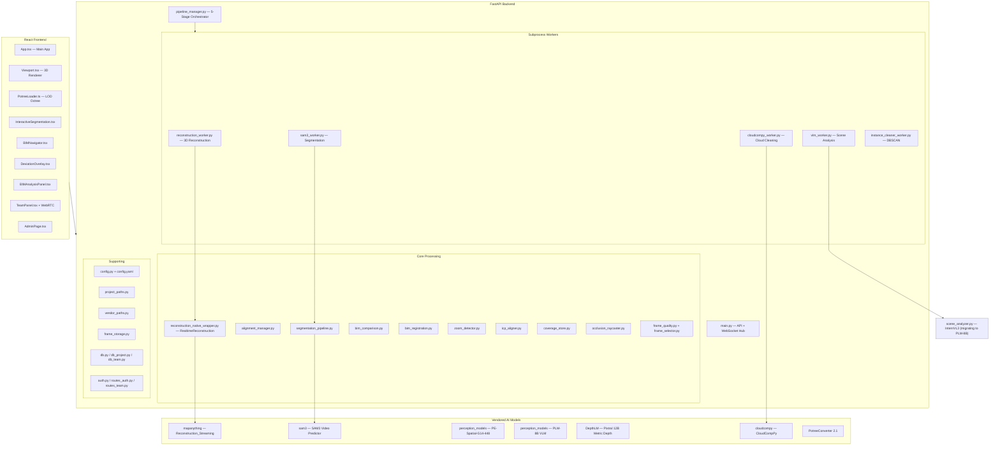
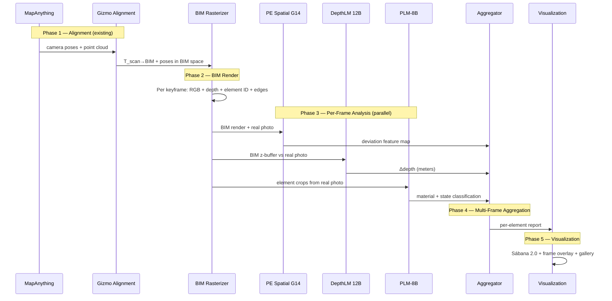
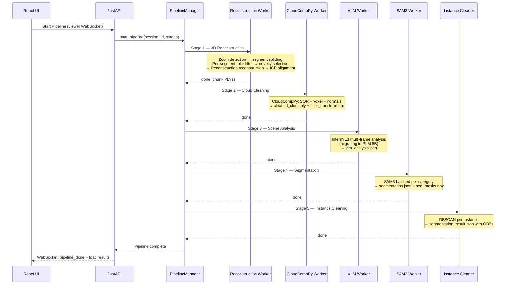

# STAC-Builder — Architecture Reference

> **Living document** — Must be updated as new modules, integrations, or architectural changes are introduced per the [ROADMAP.md](./ROADMAP.md).
>
> Last updated: 2026-03-21

---

## System Overview

STAC-Builder is an AI-powered construction and asset lifecycle platform that transforms phone-based video into accurate 3D reconstructions, performs segmentation, BIM comparison, and coverage analysis. It comprises a **Python/FastAPI backend**, a **React/Three.js frontend**, and **vendored AI models** (MapAnything, SAM3, PE Spatial, PLM-8B, DepthLM).

---

## Architecture Diagram



---

## Server Layer

### Configuration & Infrastructure

| File | Purpose |
|------|---------|
| `config.py` | YAML config loader, `DictConfig` wrapper, `get_param()` helper |
| `config.yaml` | All server/Reconstruction/SAM3/VLM/segmentation/cleaning parameters |
| `vendor_paths.py` | Resolves Reconstruction/SAM3/CloudCompPy paths, adds to `sys.path` |
| `project_paths.py` | `ProjectPaths` + `SourceContext` — hierarchical path resolution: `projects/` → scan days → sources → frames/output |
| `db.py` | SQLite setup + user/auth tables |
| `auth.py` | JWT token generation + verification |

### Main Server — `main.py`

The monolithic FastAPI server. Key sections:

- **PLY utilities**: `cloud_to_binary()`, `load_ply_to_numpy()`, `numpy_to_ply_bytes()`
- **Cloud processing**: `_run_cloudcompy_postprocess()`, `_align_cloud_to_floor()` (RANSAC), `_send_cleaned_cloud()`, `_send_sabana_cloud()`
- **Connection managers**: `CameraManager`, `ViewerManager` (WebSocket connection pools)
- **Online processing**: `chunk_processing_worker()` (real-time Reconstruction chunk loop), `_resolve_segmentation_prompt()` (VLM auto-prompt)
- **REST endpoints**: Session CRUD, BIM upload/compare, segmentation management, pipeline control, alignment save, mode switching
- **WebSockets**: Viewer (pipeline trigger, cloud loading, progress callbacks, multi-scan), Camera (MapAnything/Reconstruction flows), SLAM (real-time frame processing), Team (presence, chat, WebRTC signaling), Logs (real-time server log forwarding)

### Pipeline Manager — `pipeline_manager.py`

Orchestrates the 5-stage reconstruction pipeline sequentially as subprocesses with Pipe IPC:

1. **Reconstruction** → 3D Reconstruction
2. **CloudCompPy** → Cloud Cleaning (SOR, voxel, normals)
3. **VLM** → Scene Analysis (InternVL3)
4. **SAM3** → Video Segmentation
5. **Instance Cleaner** → DBSCAN per instance

Key classes: `StageId`, `PipelineStage`, `JobStatus`, `StageState`, `PipelineJob`, `PipelineManager`

### Workers — `server/workers/`

All workers share a pattern: `run(conn, session_dir, config)` → `run_worker_safe(_work_fn, conn, ...)` → `WorkerPipe` IPC.

| Worker | What It Does |
|--------|-------------|
| `base.py` | `WorkerPipe` (IPC: progress/log/done/error/cancel), `run_worker_safe()` |
| `reconstruction_worker.py` | Dispatches to `_run_reconstruction_single` or `_run_reconstruction_multi_segment` based on zoom analysis. Multi-segment: per-zoom blur filter → novelty selection → Reconstruction reconstruction → ICP inter-segment alignment |
| `cloudcompy_worker.py` | Runs `run_cloudcompy.sh`. Creates `cleaned_cloud.ply`, links to `merged/`, computes `floor_transform.npz` |
| `vlm_worker.py` | InternVL3 scene analysis → `vlm_analysis.json` (prompt + frame_map). Being migrated to PLM-8B |
| `sam3_worker.py` | SAM3 segmentation using VLM prompt → `segmentation.json` + `seg_masks.npz` |
| `instance_cleaner_worker.py` | DBSCAN cluster isolation per segmented instance |

### Core Processing Modules

| Module | Purpose |
|--------|---------|
| `reconstruction_native_wrapper.py` | `RealtimeReconstruction` wraps `Reconstruction_Streaming`. Per-chunk async processing with callbacks, zoom intrinsics correction, gravity transform management, metadata saving. **Fast path**: skips `super().__init__()` when `preloaded_model` is available |
| `reconstruction_config_builder.py` | Builds Reconstruction config dict from `config.yaml` (model checkpoint, weights, chunk_size, overlap, conf_threshold, etc.) |
| `alignment_manager.py` | `AlignmentManager`: RANSAC floor detection, SIM3 gravity correction, chunk-to-chunk alignment, point cloud generation with depth/conf thresholds, segmentation ID continuity mapping |
| `icp_aligner.py` | Scaled ICP registration: auto voxel sizing, FPFH features, RANSAC global registration, point-to-plane refinement, scale estimation from correspondences |
| `segmentation_pipeline.py` | Batched SAM3 processing per category, IoU ID matching across batches, NPZ mask storage with upsert logic, display-time point-to-mask matching via PLY origin fields, OBB computation |
| `sam3_wrapper.py` | `SAM3Wrapper`: model load/unload, batch/interactive/text-prompt modes, VRAM OOM recovery, mask caching, interactive session with propagation streaming |
| `scene_analyzer.py` | InternVL3 scene analysis: auto model size selection (2B/8B), dynamic resolution preprocessing, multi-frame analysis with keyframe loading, category merging with synonym detection, frame_map building. **Being migrated to PLM-8B** |
| `bim_comparison.py` | IFC mesh extraction (Revit UniqueId suffix matching), C2M distance computation (KDTree + exact triangle projection), deviation reports, sábana generation |
| `bim_registration.py` | Hierarchical BIM–scan registration: floor plane RANSAC alignment (height+tilt 3DOF) → object XZ+yaw sweep (3DOF) → full 6DOF transform |
| `coverage_store.py` | Per-element cumulative coverage: mesh surface sampling, SampleStatus (COVERED/OCCLUDED/NOT_BUILT/NOT_VISIBLE), persistent NPZ storage, timeline tracking |
| `occlusion_raycaster.py` | Ray-based BIM surface classification: camera pose loading (from Reconstruction extrinsics), cylindrical ray queries, best-camera selection, per-sample status classification |
| `zoom_detector.py` | 3 zoom detection methods (ffprobe focal length, ORB feature density, DCT frequency), segment identification with merging |
| `frame_quality.py` | Laplacian blur detection with adaptive threshold, inter-frame diff |
| `frame_selector.py` | ORB-SLAM H/F ratio keyframe selection: symmetric transfer error, Sampson distance, chi-squared scoring |
| `frame_storage.py` | `FrameStorage`: session management, frame-to-disk, chunk organization with overlap, PLY save/load with origin traceability (frame_global, pixel_row, pixel_col) |

---

## Frontend Layer

### `App.tsx` — Main Application

- **Session sidebar**: project listing with stats (frame count, cloud size, BIM presence, sábana)
- **Toolbar**: measurement tools, alignment, section box, pipeline controls
- **Pipeline dialog**: stage ordering, per-stage enable/disable, progress tracking
- **Panel system**: BIM Navigator, Deviation Overlay, BIM Analysis, Team, Segmentation
- **Console panel**: real-time server log streaming via WebSocket

### `Viewport.tsx` — 3D Renderer

Three.js-based point cloud renderer:
- Custom GLSL shaders (vertex: depth-based point sizing, fragment: circular points with EDL-like shading + section box clipping)
- Potree LOD octree loading via `PotreeLoader`
- OBB visualization from segmentation results
- Measurement tools (distance, angle)
- Floor alignment gizmo (TransformControls)
- BIM model display (IFC loader integration)
- Sábana (deviation) cloud rendering with transparency
- Section box for clipping

### `PotreeLoader.ts` — LOD Octree Loader

Custom Potree 2.0 octree loader:
- Parses `metadata.json`, `hierarchy.bin`, `octree.bin`
- Priority-queue visibility traversal (projected pixel size threshold)
- Point budget management (loaded/unloaded nodes)
- Chunked hierarchy for deep octrees (proxy nodes → sub-chunk HTTP Range requests)
- Floor transform matrix application

### Other Components

| Component | Purpose |
|-----------|---------|
| `InteractiveSegmentation.tsx` | SAM3 interactive segmentation: click/text prompts, mask painting, SSE propagation streaming, instance management |
| `BIMNavigator.tsx` | IFC tree explorer: Project→Site→Building→Storey→Elements with search, visibility, opacity |
| `DeviationOverlay.tsx` | BIM comparison UI: match selection, tolerance config, results histogram |
| `BIMAnalysisPanel.tsx` | Post-comparison report: per-element quality/advance/coverage, global progress |
| `IFCLoader.ts` | IFC→Three.js mesh loading with tree hierarchy parsing |
| `TeamPanel.tsx` | Team chat, online presence, task assignment |
| `WebRTCCall.tsx` | Video/audio calling between team members |
| `AdminPage.tsx` | User/team CRUD, session-to-team assignment |
| `LoginPage.tsx` | JWT login form |

---

## Vendor Layer

| Vendor | Purpose |
|--------|---------|
| **mapanything** | `Reconstruction_Streaming`: chunk-based monocular depth → 3D reconstruction with SIM3 alignment and loop closure |
| **perception_models** | PE-Spatial-G14-448: dense spatial features (segmentation, detection, depth). PLM-8B: VLM for scene analysis, material ID. Apache 2.0 |
| **DepthLM_Official** | DepthLM (Pixtral 12B): per-pixel metric depth estimation from single images |
| **sam3** | SAM3 Video Predictor: text/point-prompt segmentation with video propagation |
| **cloudcompy** | CloudCompPy: SOR filtering, voxel downsampling, duplicate removal, normal estimation |
| **PotreeConverter** | Converts PLY point clouds to Potree 2.0 octree format |

---

## 2D Analysis Pipeline (Tier 2)

> **Full specification:** [ADR-002: 2D Comparison Pipeline](./002-2d-comparison-pipeline.md)

Compares As-Built (real photos) against As-Planned (BIM) in 2D image space for each camera keyframe.



---

## 3D Pipeline Sequence



---

## Data Layout — Project Structure

```
projects/<project-slug>/
├── project.json                    # Project metadata
├── ifcs/                          # Uploaded IFC files
├── scans/<date>/<source>/
│   ├── frames/                    # Extracted video frames
│   │   ├── 00000.jpg ... NNNNN.jpg
│   │   ├── frame_quality.json     # Blur analysis
│   │   ├── selected_frames.json   # Novelty-filtered keyframes
│   │   └── zoom_analysis.json     # Per-frame zoom levels
│   └── output/
│       ├── chunk_*.ply            # Reconstruction raw reconstruction chunks
│       ├── chunk_*_meta.json      # Per-chunk metadata (cameras, intrinsics)
│       ├── chunk_*_origins.npz    # Per-point origin traceability
│       ├── cleaned_cloud.ply      # CloudCompPy cleaned cloud
│       ├── floor_transform.npz    # RANSAC floor alignment (s, R, t)
│       ├── vlm_analysis.json      # InternVL3 scene inventory (migrating to PLM-8B)
│       ├── segmentation.json      # SAM3 raw seg results
│       ├── segmentation_result.json # DBSCAN-cleaned with OBBs
│       ├── seg_masks.npz          # Compressed per-frame masks
│       └── potree/                # PotreeConverter output (LOD octree)
├── merged/
│   ├── merged_cloud.ply           # → symlink to cleaned_cloud.ply
│   └── floor_transform.npz       # → symlink
├── segmentation/                  # Project-level segmentation
├── coverage/                      # Cumulative coverage tracking
│   ├── timeline.json
│   └── element_*.npz
└── bim_comparison/
    ├── sabana.ply                 # Deviation-colored point cloud
    └── sabana_meta.json           # Per-element quality report
```

---

## Key Design Decisions

1. **Model caching**: Reconstruction model is loaded once and reused across zoom segments via `preloaded_model` in `RealtimeReconstruction.__init__` (fast path skips `super().__init__()`)
2. **Zoom segmentation**: Videos with zoom changes are split into segments, each processed independently, then aligned with ICP
3. **Origin traceability**: Every point in the PLY carries `(frame_global, pixel_row, pixel_col)` — this is how segmentation masks (2D) map to 3D points at display-time
4. **Gravity alignment**: Computed once from first chunk, shared across all segments. Floor transform persisted to NPZ for consistent loading
5. **Pipeline is subprocess-based**: Each stage runs in its own `multiprocessing.Process` with `Pipe` IPC — the server process never loads GPU models
6. **Potree LOD**: PotreeConverter generates octree; frontend `PotreeLoader` does priority-queue visibility traversal with configurable point budget
7. **All parameters in `config.yaml`**: No hardcoded values — all thresholds, model paths, and tuning parameters are configurable
