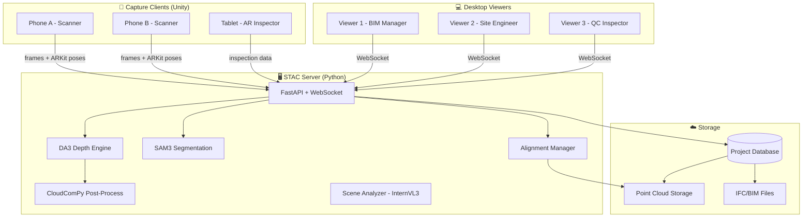
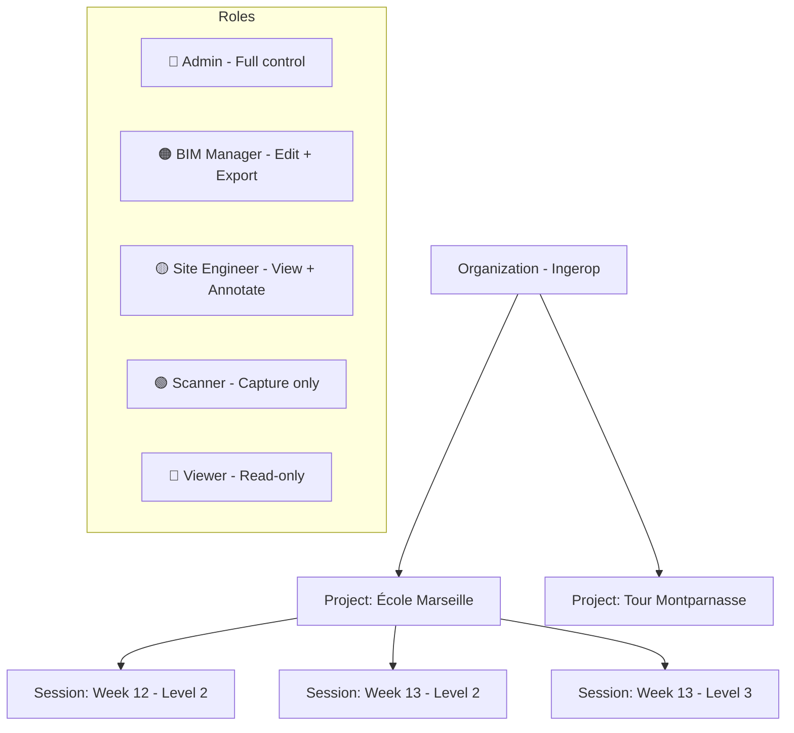

# 🏗️ STAC Build — Desktop Application Roadmap

> **Hernán Barreto — Ingerop IN3 Session IV**
> *Spatio-Temporal Awareness Core for Construction*

---

## Vision

**STAC Build** transforms construction site management by fusing AI-powered 3D scanning (smartphone cameras), BIM comparison, and temporal analysis into a single, accessible platform. Unlike Buildots (which tells you *if* something is built), STAC Build tells you *if it's built correctly* — with engineering-grade precision from a phone camera.

**Target users:** BIM Managers, Site Engineers, Project Directors, QC Inspectors, Subcontractors.

---

## Ecosystem Architecture



---

## Technology Stack — Desktop App

| Layer | Technology | Rationale |
|-------|-----------|-----------|
| **Framework** | **Electron** | Industry-standard for desktop apps. Battle-tested, mature ecosystem, cross-platform (Win/Linux/Mac) |
| **Build Tool** | **electron-vite** | Fast HMR, modern Vite-based build, React+TS template |
| **Frontend** | **React 19** + TypeScript | Component-based UI, massive ecosystem, familiar to most devs |
| **3D Renderer** | **Three.js** + **Potree** | Potree handles billions of points with octree LOD. Three.js for BIM overlay. Reuses existing `FusionRenderer.js` |
| **BIM Parser** | **IFC.js / web-ifc** | Open-source IFC parser in WASM, runs client-side, full IFC2x3/IFC4 support |
| **Charts** | **Recharts** or **Apache ECharts** | Dashboard KPIs, Gantt charts, progress charts |
| **State** | **Zustand** | Lightweight state management for complex multi-panel UI |
| **Database** | **PostgreSQL** | Multi-user from day one, scalable, industry standard |
| **Comm** | **WebSocket + REST** | Reuses existing STAC server protocol |

> **Why Electron?** Industry-standard for desktop apps (VS Code, Slack, Discord). Mature ecosystem with excellent debugging tools, auto-update support, and native OS integration. Potree + WebGL inside Electron handles massive point clouds efficiently.

---

## Project & Permissions Model



| Role | Create Project | Manage Users | Scan | View 3D | Edit Annotations | Segmentation | BIM Overlay | Export | Delete |
|------|:-:|:-:|:-:|:-:|:-:|:-:|:-:|:-:|:-:|
| **Admin** | ✅ | ✅ | ✅ | ✅ | ✅ | ✅ | ✅ | ✅ | ✅ |
| **BIM Manager** | ❌ | ❌ | ✅ | ✅ | ✅ | ✅ | ✅ | ✅ | ❌ |
| **Site Engineer** | ❌ | ❌ | ✅ | ✅ | ✅ | ❌ | ✅ | ✅ | ❌ |
| **Scanner** | ❌ | ❌ | ✅ | ✅ | ❌ | ❌ | ❌ | ❌ | ❌ |
| **Viewer** | ❌ | ❌ | ❌ | ✅ | ❌ | ❌ | ❌ | ❌ | ❌ |

---

## Application Layout

```
┌─────────────────────────────────────────────────────────────────────┐
│ ⚡ STAC Build    Project: École Marseille ▼    🔔  👤 H.Barreto    │
├──────────┬──────────────────────────────────────────────────────────┤
│ 📁 Nav   │  ┌──────────────────────────────────────────────────┐   │
│          │  │                                                  │   │
│ Dashboard│  │         3D VIEWPORT (Potree + Three.js)          │   │
│ Scans    │  │         Point Cloud + BIM Overlay                │   │
│ BIM      │  │         Section Box | Measurements               │   │
│ Timeline │  │         Clash Heatmap | Segmentation             │   │
│ Compare  │  │                                                  │   │
│ Reports  │  │                                                  │   │
│ Issues   │  ├──────────────────────────────────────────────────┤   │
│ Settings │  │ 📐 Tools | 🎯 Segment | 📏 Measure | ✂️ Section │   │
│          │  └──────────────────────────────────────────────────┘   │
│          ├──────────────────────────────────────────────────────────┤
│          │  Properties Panel / Object Inspector / Issue Details     │
└──────────┴──────────────────────────────────────────────────────────┘
```

---

## Functional Modules

### Module 1: Project Management
- Create/archive projects with metadata (location, client, dates)
- Session management (each scan = session within a project)
- User invitation and role assignment per project
- Activity log / audit trail
- Project-level configuration (tolerances, units, coordinate system)

### Module 2: 3D Point Cloud Viewer
- **Potree-based octree rendering** — handles 100M+ points smoothly
- LOD (Level of Detail) with dynamic point budget
- Navigation: orbit, fly, walk-through, first-person
- Point size/shape controls, EDL (Eye-Dome Lighting)
- **Section Box** — 6-plane clipping for interior inspection
- **Measurement tools** — point-to-point, polyline, area, angle
- **Annotations** — 3D pins with text, photos, issue links
- **Segmentation overlay** — colorized objects with labels
- Multi-cloud display — load multiple sessions simultaneously
- Coordinate system display (local, WGS84, project-specific)

### Module 3: BIM Integration
- **IFC Import** — parse IFC2x3/IFC4 files via web-ifc
- **BIM Tree Browser** — navigate IfcProject → IfcSite → IfcBuilding → IfcStorey → IfcElement
- **BIM Overlay** — render BIM geometry (wireframe/solid/transparent) on top of point cloud
- **Opacity Slider** — blend between reality (cloud) and design (BIM)
- **Object Properties** — display IFC attributes (GUID, class, material, dimensions)
- **Registration** — manual alignment (pick 3+ matching points) or automatic (ICP)
- **Clash Detection / Deviation Heatmap** — cloud-to-BIM distance analysis:
  - 🟢 Green: within tolerance (e.g., < 1cm)
  - 🟡 Yellow: warning zone (1-3cm)
  - 🔴 Red: out of tolerance (> 3cm)
  - Configurable thresholds per element type
- **Auto-Match** — STAC AI segments + spatial/semantic matching to BIM elements:
  1. Bounding box overlap filter
  2. Semantic class filter (SAM3 label ↔ IFC class)
  3. ICP geometry refinement
  4. Confidence score
- **Export BIM Status** — write as-built status back to IFC (BCF format for issues)

### Module 4: 4D Timeline / Temporal Analysis
- **Timeline Slider** — scrub through sessions chronologically
- **Split Screen** — side-by-side comparison of any two sessions
- **Difference Visualization** — highlight new construction, demolished elements, moved objects
- **Progress Tracking** — compare detected elements vs planned schedule:
  - Gantt chart integration (import from MS Project / Primavera)
  - Per-element status: Not started → In progress → Complete → Verified
  - Automatic delay detection: "Column C-4 planned for Feb 10, detected Feb 12 → 2 days late"
- **Time-lapse** — animated playback of construction progression
- **Change Detection Algorithm** — cloud-to-cloud distance analysis between sessions

### Module 5: AI Analysis
- **Automatic Segmentation** — SAM3 text-prompted object detection
- **Scene Description** — InternVL3 natural language scene analysis
- **Quality Inspection AI** — detect common defects:
  - Wall plumbness / floor flatness (FF/FL numbers)
  - Rebar spacing verification
  - MEP routing deviations
- **Object Classification** — automatic IFC class assignment from segmentation
- **Anomaly Detection** — flag unexpected objects/changes between sessions

### Module 6: Reporting & Export
- **PDF Reports** — auto-generated with screenshots, measurements, KPIs
- **Dashboard** — project-level KPIs:
  - Progress: real vs planned (%)
  - Quality score: elements within tolerance (%)
  - Open issues count by severity
  - Safety score
  - Cost impact estimation
- **Export formats:**
  - Point cloud: PLY, LAS, LAZ, E57
  - BIM: IFC, BCF (issues)
  - GIS: GeoJSON, KML
  - CAD: DXF (sections/plans)
  - Images: orthographic projections, section cuts
- **Plan Generation** — automatic 2D plan extraction from point cloud sections
- **Integration APIs** — webhooks for Autodesk Construction Cloud, Procore, Aconex

### Module 7: Collaboration
- **Real-time cursors** — see where other users are looking in 3D
- **Shared annotations** — team members see each other's notes
- **Issue tracking** — create, assign, resolve issues linked to 3D locations
- **Comments** — threaded discussions on any 3D object/annotation
- **Notifications** — alerts for new scans, issues, milestones

---

## Development Phases

### 🟢 Phase 0: Foundation (Current State)
**Status: COMPLETE ✅**

What exists today:
- [x] DA3 depth estimation pipeline (GIANT + LARGE models)
- [x] SAM3 segmentation with text prompts
- [x] Point cloud generation and alignment (SIM3)
- [x] CloudComPy post-processing (dedup, voxel, noise, normals)
- [x] FastAPI + WebSocket server
- [x] Web viewer (Three.js — `FusionRenderer.js`)
- [x] Camera capture client (web — `camera.html`)
- [x] Frame quality filtering + visual novelty selection
- [x] Scene analysis (InternVL3)
- [x] Docker containerization

---

### 🟡 Phase 1: Desktop App Scaffold + Viewer (Weeks 1-4)

**Goal:** Replace web viewer with a proper desktop app that handles massive clouds.

| Task | Priority | Effort |
|------|----------|--------|
| Initialize Tauri 2.0 + React + TypeScript project | P0 | 2 days |
| Integrate Potree for octree-based point cloud rendering | P0 | 1 week |
| Port `FusionRenderer.js` features to Potree (segmentation colors) | P0 | 3 days |
| Navigation controls (orbit, fly, walk, first-person) | P0 | 2 days |
| Section Box (6-plane clipping) | P0 | 3 days |
| Measurement tools (distance, angle, area) | P1 | 3 days |
| Eye-Dome Lighting + point styling | P1 | 2 days |
| WebSocket connection to STAC server | P0 | 1 day |
| Session browser (list, load, delete scans) | P0 | 2 days |
| Multi-cloud display (load multiple sessions) | P1 | 2 days |

**Milestone:** Load and navigate 100M+ point clouds smoothly.

---

### 🟡 Phase 2: Project Management + Auth (Weeks 5-7)

**Goal:** Multi-user project system with role-based access.

| Task | Priority | Effort |
|------|----------|--------|
| Project CRUD (create, archive, configure) | P0 | 3 days |
| User authentication (JWT + refresh tokens) | P0 | 3 days |
| Role-based access control (Admin/BIM/Engineer/Scanner/Viewer) | P0 | 3 days |
| Project invitation system (email/link) | P1 | 2 days |
| Activity log / audit trail | P1 | 2 days |
| Server-side Authorization middleware | P0 | 2 days |
| SQLite → PostgreSQL migration for multi-user | P0 | 2 days |

**Milestone:** Multiple users access the same project with different permissions.

---

### 🟡 Phase 3: BIM Integration (Weeks 8-12)

**Goal:** Import IFC, overlay on cloud, detect clashes.

| Task | Priority | Effort |
|------|----------|--------|
| IFC parser integration (web-ifc WASM) | P0 | 1 week |
| BIM tree browser (hierarchy navigation) | P0 | 3 days |
| BIM 3D rendering (wireframe/solid/transparent) | P0 | 1 week |
| Manual registration (pick-point alignment) | P0 | 3 days |
| Auto registration (ICP algorithm) | P1 | 1 week |
| Opacity slider / blend modes | P0 | 1 day |
| Cloud-to-BIM deviation heatmap | P0 | 1 week |
| Configurable tolerance thresholds per element type | P1 | 2 days |
| Auto-match: segmentation ↔ BIM GUID | P1 | 1 week |
| BCF export (issues linked to BIM elements) | P2 | 3 days |

**Milestone:** Import IFC, overlay on cloud, see red/green deviation heatmap.

---

### 🟡 Phase 4: 4D Timeline + Comparison (Weeks 13-16)

**Goal:** Temporal analysis and construction progress tracking.

| Task | Priority | Effort |
|------|----------|--------|
| Timeline slider (session chronological navigation) | P0 | 3 days |
| Split-screen comparison (any two sessions) | P0 | 1 week |
| Cloud-to-cloud difference visualization | P0 | 1 week |
| Gantt chart import (MS Project XML / Primavera XER) | P1 | 1 week |
| Per-element progress status tracking | P1 | 3 days |
| Automatic delay detection (planned vs actual) | P1 | 3 days |
| Time-lapse animation (session playback) | P2 | 3 days |

**Milestone:** Side-by-side comparison with highlighted differences and delay flags.

---

### 🟡 Phase 5: Reporting + Dashboard (Weeks 17-19)

**Goal:** Project-level KPIs, automated reports, export.

| Task | Priority | Effort |
|------|----------|--------|
| Dashboard with KPI cards (progress, quality, issues, safety) | P0 | 1 week |
| Chart components (progress over time, quality distribution) | P0 | 3 days |
| PDF report generator (screenshots + metrics + issues) | P0 | 1 week |
| Export: PLY, LAS/LAZ, E57 | P0 | 3 days |
| Export: DXF sections (2D plan from point cloud slices) | P1 | 1 week |
| Export: orthographic images | P1 | 3 days |
| Issue tracking system (create, assign, resolve, link to 3D) | P0 | 1 week |
| Integration webhooks (Autodesk, Procore) | P2 | 1 week |

**Milestone:** One-click report generation with screenshots, KPIs, and issue list.

---

### 🟡 Phase 6: Advanced AI Features (Weeks 20-24)

**Goal:** Automatic quality inspection and plan generation.

| Task | Priority | Effort |
|------|----------|--------|
| Wall plumbness / floor flatness analysis | P1 | 1 week |
| Automatic 2D plan generation from cloud sections | P1 | 2 weeks |
| MEP detection and routing analysis | P2 | 2 weeks |
| Rebar spacing verification | P2 | 1 week |
| Anomaly detection between sessions | P1 | 1 week |
| Auto-classification: segment → IFC class | P1 | 1 week |

**Milestone:** Automatic quality metrics and generated floor plans.

---

### 🟡 Phase 7: Unity Capture Client (Weeks 25-30)

**Goal:** Replace web camera.html with professional Unity app.

| Task | Priority | Effort |
|------|----------|--------|
| Unity project setup (ARFoundation + ARKit/ARCore) | P0 | 3 days |
| Camera capture with ARKit pose fusion | P0 | 1 week |
| Real-time streaming to STAC server | P0 | 1 week |
| AR preview (see cloud building in real-time) | P1 | 2 weeks |
| Guided scanning (coverage heatmap overlay) | P1 | 1 week |
| Offline capture mode (queue for upload) | P1 | 1 week |
| QR code pairing with project | P2 | 3 days |

**Milestone:** Scan a room from a phone, see cloud appear in real-time on desktop.

---

## Current Status Matrix

| Component | Status | Notes |
|-----------|--------|-------|
| DA3 Depth Pipeline | ✅ Complete | GIANT (CPU) + LARGE (GPU) |
| SAM3 Segmentation | ✅ Complete | Text-prompted, chunk-based |
| Point Cloud Alignment | ✅ Complete | SIM3 + loop closure |
| CloudComPy Post-Process | ✅ Complete | Dedup, voxel, noise, normals |
| Web Viewer | ✅ Complete | Three.js, limited to ~5M points |
| Web Camera | ✅ Complete | HTML5, basic |
| Docker | ✅ Complete | CUDA 12.1, full pipeline |
| Scene Analyzer | ✅ Complete | InternVL3 |
| Desktop App | ❌ Not started | → Phase 1 |
| Project Management | ❌ Not started | → Phase 2 |
| BIM Integration | ❌ Not started | → Phase 3 |
| 4D Timeline | ❌ Not started | → Phase 4 |
| Reports/Dashboard | ❌ Not started | → Phase 5 |
| AI Quality Inspection | ❌ Not started | → Phase 6 |
| Unity Capture | ❌ Not started | → Phase 7 |

---

## Key Differentiators vs Competition

| Feature | Buildots | Matterport | OpenSpace | **STAC Build** |
|---------|----------|------------|-----------|----------------|
| Capture device | 360° camera ($$$) | Pro camera ($$$) | 360° camera ($$$) | **Phone camera (free)** |
| AI depth | ❌ | Proprietary | ❌ | **DA3 (open, metric)** |
| BIM comparison | Basic | ❌ | Basic | **Full deviation heatmap** |
| Segmentation | Basic | ❌ | ❌ | **SAM3 text-prompted** |
| Offline capable | ❌ | ❌ | ❌ | **Yes (full pipeline)** |
| Self-hosted | ❌ | ❌ | ❌ | **Yes (on-premise OK)** |
| Open source | ❌ | ❌ | ❌ | **Core engine open** |
| Price | $$$$ | $$$ | $$$$ | **Accessible** |

---

## File Structure (Target)

```
stac-builder/
├── server/                    # Python backend (exists)
├── vendor/                    # DA3, SAM3, CloudComPy (exists)
├── static/                    # Legacy web viewer (exists)
├── ui/                        # 🆕 Desktop application
│   ├── ROADMAP.md             # This document
│   ├── src-tauri/             # Tauri Rust backend
│   │   ├── src/
│   │   ├── Cargo.toml
│   │   └── tauri.conf.json
│   ├── src/                   # React frontend
│   │   ├── App.tsx
│   │   ├── main.tsx
│   │   ├── components/
│   │   │   ├── viewport/      # 3D viewer (Potree + Three.js)
│   │   │   ├── sidebar/       # Navigation + panels
│   │   │   ├── bim/           # BIM browser + overlay
│   │   │   ├── timeline/      # 4D comparison
│   │   │   ├── dashboard/     # KPIs + charts
│   │   │   ├── issues/        # Issue tracker
│   │   │   └── reports/       # Report generator
│   │   ├── services/          # API + WebSocket clients
│   │   ├── stores/            # Zustand state
│   │   └── types/             # TypeScript types
│   ├── public/
│   │   └── potree/            # Potree lib + workers
│   ├── package.json
│   └── tsconfig.json
├── unity/                     # 🆕 Unity capture client (Phase 7)
└── docs/
```

---

## Next Steps

1. **Validate this roadmap** — review priorities, adjust timeline
2. **Phase 1 kickoff** — initialize Tauri + React project, integrate Potree
3. **Design system** — define color palette, typography, component library (dark theme)
4. **API spec** — document all server endpoints needed for desktop app
